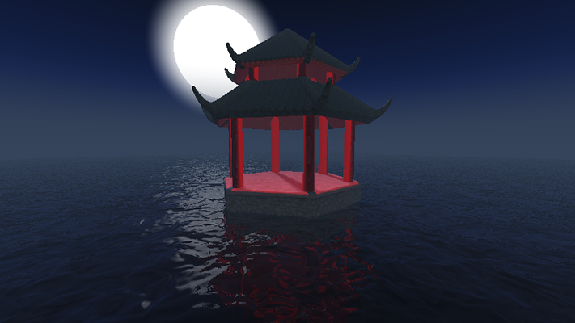
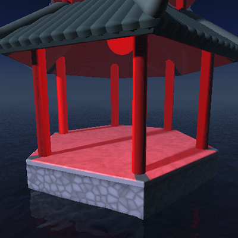
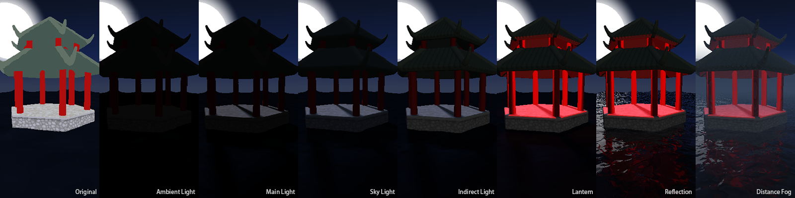

# Haoran Wei (82926501)

## Demo
 - [Demo on ShaderToy](https://www.shadertoy.com/view/wsjGWc)
 - [Demo Page](https://whaoran0718.github.io/hw03-environment-setpiece/)

## Techniques
### Pavilion SDF
Apply absolute sine function on displacement to create tiles on ceiling. 
According to the symmetric attribute of the hexagon pavilion, duplicate one sixth of ceiling and pillars 
rotating around the center axis instead of working on sdf six times in a loop.

### Base UV
Unwrap uv of hexagonal prism for pavilion base according to its symmetric attribute. 
Use perturbed FBM Perlin noise to draw the top surface of the base. 
Texture of side surfaces is generated from Worley noise tracking the nearest cell point and the secondary.

### Water
Using perturbed FBM Perlin noise to generate height map of water wave. 
Add Fresnel reflection effect for the water based on [Schlick's Approximation](https://en.wikipedia.org/wiki/Schlick%27s_approximation).

### Lighting
There are four light sources with a faint ambient light in the scene: 
white directional light of moon and red point light of lantern casting softshadow, 
bluish skylight from above and yellowish indirect light on opposite for compensation.

### Distance Fog
Add inverse-exponential distance fog based on both distance from camera and height.

### Optimization
Use looping form of normal calculation instead of nested to speed up loading process.

## External Resources
- [IQ's Article on Lighting](http://iquilezles.org/www/articles/outdoorslighting/outdoorslighting.htm)
- [Schlick's Approximation](https://en.wikipedia.org/wiki/Schlick%27s_approximation)